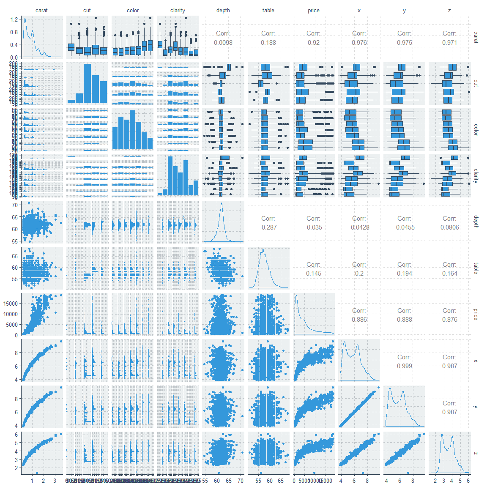
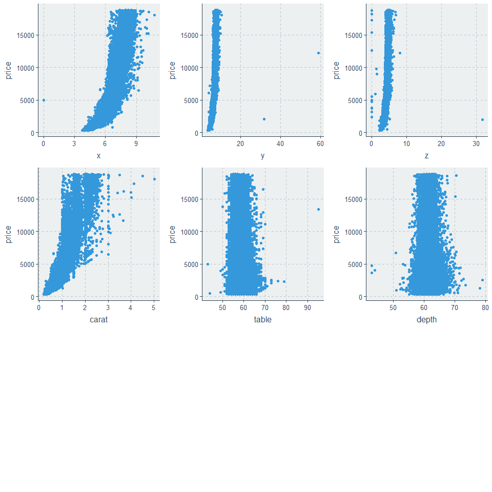
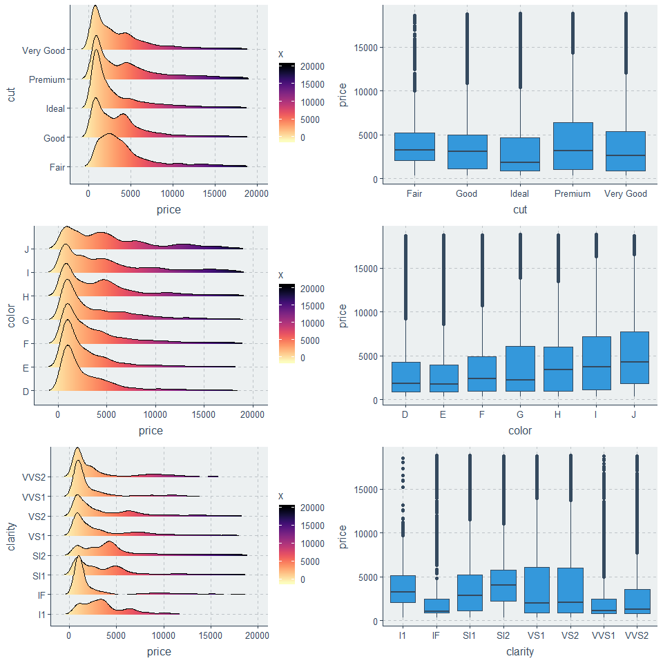
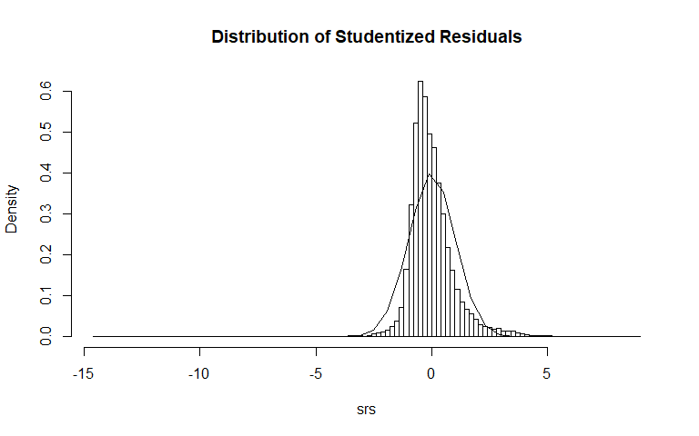
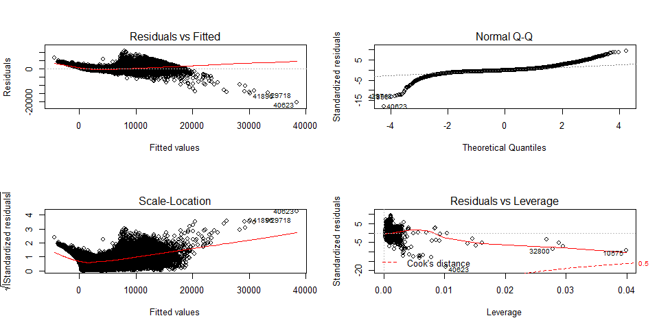
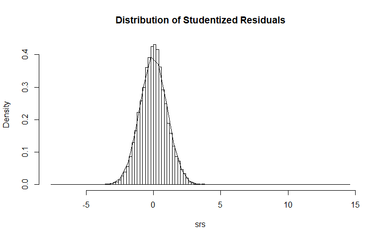
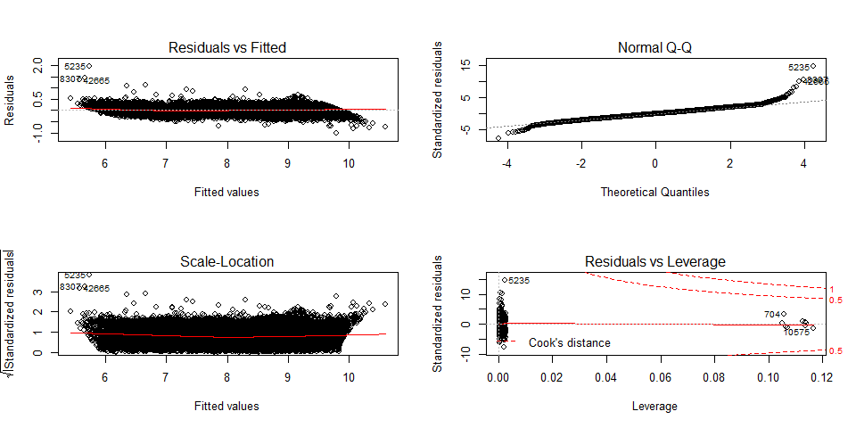
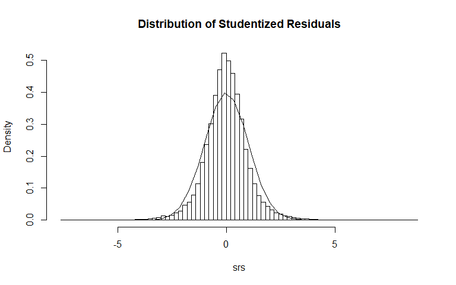

```r
library(tidyverse)
library(skimr)
library(GGally)
library(corrr)
library(corrplot)
library(ggridges)
library(viridis)
library(hrbrthemes)
library(ggpubr)
library(moderndive)
library(olsrr)
library(MASS)
```


```r
diamonds <- read_csv("diamonds.csv")
```

X : Length of the Diamond in mm.
Y : Width of the Diamond in mm.
Z : Height of the Diamond in mm.


```r
glimpse(diamonds)
```

```
## Observations: 53,940
## Variables: 11
## $ X1      <dbl> 1, 2, 3, 4, 5, 6, 7, 8, 9, 10, 11, 12, 13, 14, 15, 16, 17, 18…
## $ carat   <dbl> 0.23, 0.21, 0.23, 0.29, 0.31, 0.24, 0.24, 0.26, 0.22, 0.23, 0…
## $ cut     <chr> "Ideal", "Premium", "Good", "Premium", "Good", "Very Good", "…
## $ color   <chr> "E", "E", "E", "I", "J", "J", "I", "H", "E", "H", "J", "J", "…
## $ clarity <chr> "SI2", "SI1", "VS1", "VS2", "SI2", "VVS2", "VVS1", "SI1", "VS…
## $ depth   <dbl> 61.5, 59.8, 56.9, 62.4, 63.3, 62.8, 62.3, 61.9, 65.1, 59.4, 6…
## $ table   <dbl> 55, 61, 65, 58, 58, 57, 57, 55, 61, 61, 55, 56, 61, 54, 62, 5…
## $ price   <dbl> 326, 326, 327, 334, 335, 336, 336, 337, 337, 338, 339, 340, 3…
## $ x       <dbl> 3.95, 3.89, 4.05, 4.20, 4.34, 3.94, 3.95, 4.07, 3.87, 4.00, 4…
## $ y       <dbl> 3.98, 3.84, 4.07, 4.23, 4.35, 3.96, 3.98, 4.11, 3.78, 4.05, 4…
## $ z       <dbl> 2.43, 2.31, 2.31, 2.63, 2.75, 2.48, 2.47, 2.53, 2.49, 2.39, 2…
```


```r
diamonds$cut <- as.factor(diamonds$cut)
diamonds$color <- as.factor(diamonds$color)
diamonds$clarity <- as.factor(diamonds$clarity)
```


```r
skim(diamonds)
```


Table: Data summary

                                    
-------------------------  ---------
Name                       diamonds 
Number of rows             53940    
Number of columns          11       
_______________________             
Column type frequency:              
factor                     3        
numeric                    8        
________________________            
Group variables            None     
-------------------------  ---------


**Variable type: factor**

skim_variable    n_missing   complete_rate  ordered    n_unique  top_counts                                    
--------------  ----------  --------------  --------  ---------  ----------------------------------------------
cut                      0               1  FALSE             5  Ide: 21551, Pre: 13791, Ver: 12082, Goo: 4906 
color                    0               1  FALSE             7  G: 11292, E: 9797, F: 9542, H: 8304           
clarity                  0               1  FALSE             8  SI1: 13065, VS2: 12258, SI2: 9194, VS1: 8171  


**Variable type: numeric**

skim_variable    n_missing   complete_rate       mean         sd      p0        p25        p50        p75       p100  hist  
--------------  ----------  --------------  ---------  ---------  ------  ---------  ---------  ---------  ---------  ------
X1                       0               1   26970.50   15571.28     1.0   13485.75   26970.50   40455.25   53940.00  ▇▇▇▇▇ 
carat                    0               1       0.80       0.47     0.2       0.40       0.70       1.04       5.01  ▇▂▁▁▁ 
depth                    0               1      61.75       1.43    43.0      61.00      61.80      62.50      79.00  ▁▁▇▁▁ 
table                    0               1      57.46       2.23    43.0      56.00      57.00      59.00      95.00  ▁▇▁▁▁ 
price                    0               1    3932.80    3989.44   326.0     950.00    2401.00    5324.25   18823.00  ▇▂▁▁▁ 
x                        0               1       5.73       1.12     0.0       4.71       5.70       6.54      10.74  ▁▁▇▃▁ 
y                        0               1       5.73       1.14     0.0       4.72       5.71       6.54      58.90  ▇▁▁▁▁ 
z                        0               1       3.54       0.71     0.0       2.91       3.53       4.04      31.80  ▇▁▁▁▁ 


```r
diamonds[, c(1, 9:11)] %>%
  filter(x == 0 | y == 0 | z == 0)
```

```
## # A tibble: 20 x 4
##       X1     x     y     z
##    <dbl> <dbl> <dbl> <dbl>
##  1  2208  6.55  6.48     0
##  2  2315  6.66  6.6      0
##  3  4792  6.5   6.47     0
##  4  5472  6.5   6.47     0
##  5 10168  7.15  7.04     0
##  6 11183  0     6.62     0
##  7 11964  0     0        0
##  8 13602  6.88  6.83     0
##  9 15952  0     0        0
## 10 24395  8.49  8.45     0
## 11 24521  0     0        0
## 12 26124  8.52  8.42     0
## 13 26244  0     0        0
## 14 27113  8.42  8.37     0
## 15 27430  0     0        0
## 16 27504  8.02  7.95     0
## 17 27740  8.9   8.85     0
## 18 49557  0     0        0
## 19 49558  0     0        0
## 20 51507  6.71  6.67     0
```


```r
diamonds <- diamonds[,-1] %>%
  filter(x != 0 | y != 0 | z != 0)
```

Create a new variable.

```r
diamonds$volume <- diamonds$x * diamonds$y * diamonds$z
```


```r
smp_siz = floor(0.80*nrow(diamonds))
set.seed(123)
train_ind = sample(seq_len(nrow(diamonds)), size = smp_siz)
train = diamonds[train_ind,]
test = diamonds[-train_ind,] 
```


```r
ggpairs(train[4000:6000,])
```

<!-- -->


```r
cor_mat <- cor(train[, -c(2:4)])
cor_mat
```

```
##             carat        depth      table       price           x           y
## carat  1.00000000  0.025885470  0.1821634  0.92179780  0.97758001  0.94856258
## depth  0.02588547  1.000000000 -0.2995327 -0.01068854 -0.02775043 -0.03143387
## table  0.18216342 -0.299532689  1.0000000  0.12707642  0.19752901  0.18461968
## price  0.92179780 -0.010688543  0.1270764  1.00000000  0.88760093  0.86335956
## x      0.97758001 -0.027750426  0.1975290  0.88760093  1.00000000  0.96947100
## y      0.94856258 -0.031433869  0.1846197  0.86335956  0.96947100  1.00000000
## z      0.97060583  0.094711472  0.1561591  0.87764439  0.98579920  0.96268263
## volume 0.97296815  0.006735367  0.1680092  0.89939572  0.95336424  0.97632579
##                 z      volume
## carat  0.97060583 0.972968147
## depth  0.09471147 0.006735367
## table  0.15615910 0.168009151
## price  0.87764439 0.899395724
## x      0.98579920 0.953364243
## y      0.96268263 0.976325793
## z      1.00000000 0.955497345
## volume 0.95549735 1.000000000
```


```r
corrplot(cor_mat, method="pie", type="lower", addCoef.col = "black")
```

<!-- -->


```r
plot1 <- diamonds %>%
  ggplot(aes(x = x, y = price)) + 
  geom_point()
plot2 <- diamonds %>%
  ggplot(aes(x = y, y = price)) + 
  geom_point()

plot3 <- diamonds %>%
  ggplot(aes(x = z, y = price)) + 
  geom_point()
plot4 <- diamonds %>%
  ggplot(aes(x = carat, y = price)) + 
  geom_point()

plot5 <- diamonds %>%
  ggplot(aes(x = table, y = price)) +
  geom_point()
plot6 <- diamonds %>%
  ggplot(aes(x = depth, y = price)) + 
  geom_point()

ggarrange(plot1, plot2, plot3, plot4, plot5, plot6, ncol = 3, nrow = 3)
```

<!-- -->


```r
plot1 <- train %>%
  ggplot((aes(x = price, y = cut, fill = ..x..))) + 
  geom_density_ridges_gradient(scale = 2, rel_min_height = 0.01) +
  scale_fill_viridis(option = "A", direction = -1)
plot2 <- train %>%
  ggplot((aes(x = cut, y = price))) +
  geom_boxplot()

plot3 <- train %>%
  ggplot((aes(x = price, y = color, fill = ..x..))) + 
  geom_density_ridges_gradient(scale = 2, rel_min_height = 0.01) +
  scale_fill_viridis(option = "A", direction = -1)
plot4 <- train %>%
  ggplot((aes(x = color, y = price))) +
  geom_boxplot()

plot5 <- train %>%
  ggplot((aes(x = price, y = clarity, fill = ..x..))) + 
  geom_density_ridges_gradient(scale = 2, rel_min_height = 0.01) +
  scale_fill_viridis(option = "A", direction = -1)
plot6 <- train %>%
  ggplot((aes(x = clarity, y = price))) +
  geom_boxplot()

ggarrange(plot1, plot2, plot3, plot4, plot5, plot6, ncol = 2, nrow = 3)
```

<!-- -->


```r
model_single <- lm(price ~ carat, data = train)
get_regression_summaries(model_single)
```

```
## # A tibble: 1 x 8
##   r_squared adj_r_squared      mse  rmse sigma statistic p_value    df
##       <dbl>         <dbl>    <dbl> <dbl> <dbl>     <dbl>   <dbl> <dbl>
## 1      0.85          0.85 2398614. 1549. 1549.   243930.       0     2
```


```r
model_full <- lm(price ~ ., data = train)
get_regression_summaries(model_full)
```

```
## # A tibble: 1 x 8
##   r_squared adj_r_squared      mse  rmse sigma statistic p_value    df
##       <dbl>         <dbl>    <dbl> <dbl> <dbl>     <dbl>   <dbl> <dbl>
## 1      0.92          0.92 1279080. 1131. 1131.    20622.       0    25
```


```r
model_bw <- step(model_full, direction = "backward", trace = FALSE)
model_fw <- step(model_single, scope = list(lower = model_single, upper = model_full), direction = "forward", trace = FALSE)
model_bo <- step(model_single, scope = list(lower = model_single, upper = model_full), direction = "both", trace = FALSE)
```


```
## [1] "Step Backward:  price ~ carat + cut + color + clarity + depth + table + x + y + z + volume"
```

```
## [1] "Step Forward:  price ~ carat + clarity + color + x + cut + depth + table + volume + y + z"
```

```
## [1] "Step Both:  price ~ carat + clarity + color + x + cut + depth + table + volume + y + z"
```


```r
get_regression_summaries(model_bw)
```

```
## # A tibble: 1 x 8
##   r_squared adj_r_squared      mse  rmse sigma statistic p_value    df
##       <dbl>         <dbl>    <dbl> <dbl> <dbl>     <dbl>   <dbl> <dbl>
## 1      0.92          0.92 1279080. 1131. 1131.    20622.       0    25
```

```r
get_regression_summaries(model_fw)
```

```
## # A tibble: 1 x 8
##   r_squared adj_r_squared      mse  rmse sigma statistic p_value    df
##       <dbl>         <dbl>    <dbl> <dbl> <dbl>     <dbl>   <dbl> <dbl>
## 1      0.92          0.92 1279080. 1131. 1131.    20622.       0    25
```

```r
get_regression_summaries(model_bo)
```

```
## # A tibble: 1 x 8
##   r_squared adj_r_squared      mse  rmse sigma statistic p_value    df
##       <dbl>         <dbl>    <dbl> <dbl> <dbl>     <dbl>   <dbl> <dbl>
## 1      0.92          0.92 1279080. 1131. 1131.    20622.       0    25
```


```r
car::vif(model_bo)
```

```
##               GVIF Df GVIF^(1/(2*Df))
## carat   146.152118  1       12.089339
## clarity   1.349371  7        1.021633
## color     1.180666  6        1.013936
## x       282.818667  1       16.817213
## cut       2.045555  4        1.093582
## depth     3.218360  1        1.793979
## table     1.807284  1        1.344353
## volume  143.022783  1       11.959213
## y       111.193483  1       10.544832
## z       104.563663  1       10.225638
```


```r
model_bo_vif <- lm(price ~ carat + cut + color + clarity + depth + table + z, data = train)
car::vif(model_bo_vif)
```

```
##              GVIF Df GVIF^(1/(2*Df))
## carat   19.411236  1        4.405818
## cut      1.920970  4        1.085026
## color    1.176628  6        1.013647
## clarity  1.333244  7        1.020756
## depth    1.457653  1        1.207333
## table    1.788128  1        1.337209
## z       19.455282  1        4.410814
```


```r
model_bo_vif <- lm(price ~ carat + cut + color + clarity + depth + table, data = train)
car::vif(model_bo_vif)
```

```
##             GVIF Df GVIF^(1/(2*Df))
## carat   1.320765  1        1.149245
## cut     1.917285  4        1.084765
## color   1.168465  6        1.013059
## clarity 1.300861  7        1.018965
## depth   1.374470  1        1.172378
## table   1.788047  1        1.337179
```


```r
get_regression_summaries(model_bo_vif)
```

```
## # A tibble: 1 x 8
##   r_squared adj_r_squared      mse  rmse sigma statistic p_value    df
##       <dbl>         <dbl>    <dbl> <dbl> <dbl>     <dbl>   <dbl> <dbl>
## 1     0.916         0.916 1343160. 1159. 1159.    23465.       0    21
```

Testing the Normality Assumption

```r
srs <- studres(model_bo_vif)
hist(srs, freq=FALSE, 
     main="Distribution of Studentized Residuals",
     breaks=100)
xfit<-seq(min(srs),max(srs),length=40) 
yfit<-dnorm(xfit) 
lines(xfit, yfit)
```

<!-- -->


```r
ks.test(studres(model_bo_vif), dnorm(xfit))
```

```
## Warning in ks.test(studres(model_bo_vif), dnorm(xfit)): p-value will be
## approximate in the presence of ties
```

```
## 
## 	Two-sample Kolmogorov-Smirnov test
## 
## data:  studres(model_bo_vif) and dnorm(xfit)
## D = 0.58251, p-value = 3.333e-12
## alternative hypothesis: two-sided
```


```r
par(mfrow = c(2,2))
plot(model_bo_vif)
```

<!-- -->

## Log Transformation


```r
train$caratlog <- log(train$carat)
train$pricelog <- log(train$price)
train$depthlog <- log(train$depth)
train$tablelog <- log(train$table)
train$volumelog <- log(train$volume + 0.000001)
```


```r
model_full <- lm(pricelog ~ cut + color + clarity + caratlog + depthlog + tablelog + volumelog, data=train)
model_bw <- step(model_full, direction = "backward", trace = FALSE)
```


```r
model_bo_vif <- model_bw
```


```r
car::vif(model_bo_vif)
```

```
##               GVIF Df GVIF^(1/(2*Df))
## cut       1.107703  4        1.012868
## color     1.139738  6        1.010960
## clarity   1.319876  7        1.020022
## caratlog  5.499759  1        2.345157
## volumelog 5.149635  1        2.269281
```

Testing the Normality Assumption

```r
srs <- studres(model_bo_vif)
hist(srs, freq=FALSE, 
     main="Distribution of Studentized Residuals",
     breaks=100)
xfit<-seq(min(srs),max(srs),length=40) 
yfit<-dnorm(xfit) 
lines(xfit, yfit)
```

<!-- -->


```r
ks.test(studres(model_bo_vif), dnorm(xfit)) 
```

```
## Warning in ks.test(studres(model_bo_vif), dnorm(xfit)): p-value will be
## approximate in the presence of ties
```

```
## 
## 	Two-sample Kolmogorov-Smirnov test
## 
## data:  studres(model_bo_vif) and dnorm(xfit)
## D = 0.50081, p-value = 3.936e-09
## alternative hypothesis: two-sided
```


```r
par(mfrow = c(2,2))
plot(model_bo_vif)
```

<!-- -->

## Removing Outlier


```r
#box <- boxplot(train$pricelog)
```


```r
plot <- ols_plot_cooksd_chart(model_bo_vif)
```

<!-- -->


```r
data_plot <- plot$data
index_outlier <- data_plot[data_plot$color == "outlier",]$obs
train_outlier <- train[index_outlier,]
train_clean <- train[-index_outlier,]
```

Testing the Normality Assumption

```r
srs <- studres(model_bo_vif)
hist(srs, freq=FALSE, 
     main="Distribution of Studentized Residuals",
     breaks=100)
xfit<-seq(min(srs),max(srs), length=40) 
yfit<-dnorm(xfit) 
lines(xfit, yfit)
```

<!-- -->


```r
ks.test(studres(model_bo_vif), dnorm(xfit)) 
```

```
## Warning in ks.test(studres(model_bo_vif), dnorm(xfit)): p-value will be
## approximate in the presence of ties
```

```
## 
## 	Two-sample Kolmogorov-Smirnov test
## 
## data:  studres(model_bo_vif) and dnorm(xfit)
## D = 0.50081, p-value = 3.936e-09
## alternative hypothesis: two-sided
```


```r
par(mfrow = c(2,2))
plot(model_bo_vif)
```

<!-- -->
