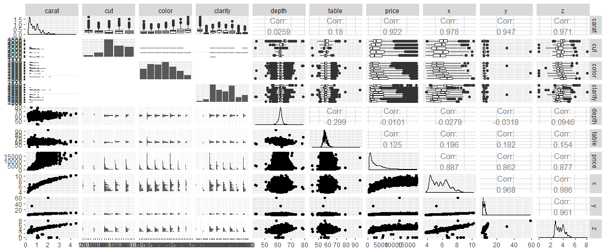
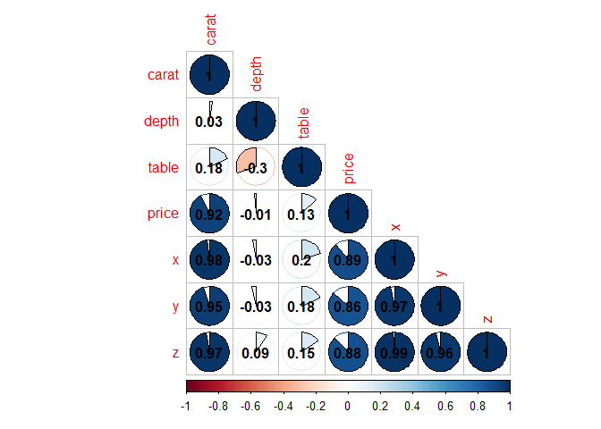

```r
library(tidyverse)
```

```
## -- Attaching packages ------------- tidyverse 1.3.0 --
```

```
## <U+2713> ggplot2 3.2.1     <U+2713> purrr   0.3.3
## <U+2713> tibble  2.1.3     <U+2713> dplyr   0.8.3
## <U+2713> tidyr   1.0.0     <U+2713> stringr 1.4.0
## <U+2713> readr   1.3.1     <U+2713> forcats 0.4.0
```

```
## Warning: package 'stringr' was built under R version 3.6.2
```

```
## -- Conflicts ---------------- tidyverse_conflicts() --
## x dplyr::filter() masks stats::filter()
## x dplyr::lag()    masks stats::lag()
```

```r
library(skimr)
```

```
## Warning: package 'skimr' was built under R version 3.6.2
```

```r
library(GGally)
```

```
## Warning: package 'GGally' was built under R version 3.6.2
```

```
## Registered S3 method overwritten by 'GGally':
##   method from   
##   +.gg   ggplot2
```

```
## 
## Attaching package: 'GGally'
```

```
## The following object is masked from 'package:dplyr':
## 
##     nasa
```

```r
library(corrr)
```

```
## Warning: package 'corrr' was built under R version 3.6.2
```

```
## 
## Attaching package: 'corrr'
```

```
## The following object is masked from 'package:skimr':
## 
##     focus
```

```r
library(corrplot)
```

```
## Warning: package 'corrplot' was built under R version 3.6.2
```

```
## corrplot 0.84 loaded
```

```r
library(ggridges)
```

```
## Warning: package 'ggridges' was built under R version 3.6.2
```

```r
library(viridis)
```

```
## Warning: package 'viridis' was built under R version 3.6.2
```

```
## Loading required package: viridisLite
```

```r
library(hrbrthemes)
```

```
## Warning: package 'hrbrthemes' was built under R version 3.6.2
```

```r
library(ggpubr)
```

```
## Warning: package 'ggpubr' was built under R version 3.6.2
```

```
## Loading required package: magrittr
```

```
## 
## Attaching package: 'magrittr'
```

```
## The following object is masked from 'package:purrr':
## 
##     set_names
```

```
## The following object is masked from 'package:tidyr':
## 
##     extract
```


```r
diamonds <- read_csv("diamonds.csv")
```

```
## Warning: Missing column names filled in: 'X1' [1]
```

```
## Parsed with column specification:
## cols(
##   X1 = col_double(),
##   carat = col_double(),
##   cut = col_character(),
##   color = col_character(),
##   clarity = col_character(),
##   depth = col_double(),
##   table = col_double(),
##   price = col_double(),
##   x = col_double(),
##   y = col_double(),
##   z = col_double()
## )
```


```r
glimpse(diamonds)
```

```
## Observations: 53,940
## Variables: 11
## $ X1      <dbl> 1, 2, 3, 4, 5, 6, 7, 8, 9, 10, 11, 12, 13, 14, 15, 16, 17, 18…
## $ carat   <dbl> 0.23, 0.21, 0.23, 0.29, 0.31, 0.24, 0.24, 0.26, 0.22, 0.23, 0…
## $ cut     <chr> "Ideal", "Premium", "Good", "Premium", "Good", "Very Good", "…
## $ color   <chr> "E", "E", "E", "I", "J", "J", "I", "H", "E", "H", "J", "J", "…
## $ clarity <chr> "SI2", "SI1", "VS1", "VS2", "SI2", "VVS2", "VVS1", "SI1", "VS…
## $ depth   <dbl> 61.5, 59.8, 56.9, 62.4, 63.3, 62.8, 62.3, 61.9, 65.1, 59.4, 6…
## $ table   <dbl> 55, 61, 65, 58, 58, 57, 57, 55, 61, 61, 55, 56, 61, 54, 62, 5…
## $ price   <dbl> 326, 326, 327, 334, 335, 336, 336, 337, 337, 338, 339, 340, 3…
## $ x       <dbl> 3.95, 3.89, 4.05, 4.20, 4.34, 3.94, 3.95, 4.07, 3.87, 4.00, 4…
## $ y       <dbl> 3.98, 3.84, 4.07, 4.23, 4.35, 3.96, 3.98, 4.11, 3.78, 4.05, 4…
## $ z       <dbl> 2.43, 2.31, 2.31, 2.63, 2.75, 2.48, 2.47, 2.53, 2.49, 2.39, 2…
```


```r
diamonds$cut <- as.factor(diamonds$cut)
diamonds$color <- as.factor(diamonds$color)
diamonds$clarity <- as.factor(diamonds$clarity)
```


```r
skim(diamonds)
```


Table: Data summary

                                    
-------------------------  ---------
Name                       diamonds 
Number of rows             53940    
Number of columns          11       
_______________________             
Column type frequency:              
factor                     3        
numeric                    8        
________________________            
Group variables            None     
-------------------------  ---------


**Variable type: factor**

skim_variable    n_missing   complete_rate  ordered    n_unique  top_counts                                    
--------------  ----------  --------------  --------  ---------  ----------------------------------------------
cut                      0               1  FALSE             5  Ide: 21551, Pre: 13791, Ver: 12082, Goo: 4906 
color                    0               1  FALSE             7  G: 11292, E: 9797, F: 9542, H: 8304           
clarity                  0               1  FALSE             8  SI1: 13065, VS2: 12258, SI2: 9194, VS1: 8171  


**Variable type: numeric**

skim_variable    n_missing   complete_rate       mean         sd      p0        p25        p50        p75       p100  hist  
--------------  ----------  --------------  ---------  ---------  ------  ---------  ---------  ---------  ---------  ------
X1                       0               1   26970.50   15571.28     1.0   13485.75   26970.50   40455.25   53940.00  ▇▇▇▇▇ 
carat                    0               1       0.80       0.47     0.2       0.40       0.70       1.04       5.01  ▇▂▁▁▁ 
depth                    0               1      61.75       1.43    43.0      61.00      61.80      62.50      79.00  ▁▁▇▁▁ 
table                    0               1      57.46       2.23    43.0      56.00      57.00      59.00      95.00  ▁▇▁▁▁ 
price                    0               1    3932.80    3989.44   326.0     950.00    2401.00    5324.25   18823.00  ▇▂▁▁▁ 
x                        0               1       5.73       1.12     0.0       4.71       5.70       6.54      10.74  ▁▁▇▃▁ 
y                        0               1       5.73       1.14     0.0       4.72       5.71       6.54      58.90  ▇▁▁▁▁ 
z                        0               1       3.54       0.71     0.0       2.91       3.53       4.04      31.80  ▇▁▁▁▁ 


```r
diamonds[, c(1, 9:11)] %>%
  filter(x == 0 | y == 0 | z == 0)
```

```
## # A tibble: 20 x 4
##       X1     x     y     z
##    <dbl> <dbl> <dbl> <dbl>
##  1  2208  6.55  6.48     0
##  2  2315  6.66  6.6      0
##  3  4792  6.5   6.47     0
##  4  5472  6.5   6.47     0
##  5 10168  7.15  7.04     0
##  6 11183  0     6.62     0
##  7 11964  0     0        0
##  8 13602  6.88  6.83     0
##  9 15952  0     0        0
## 10 24395  8.49  8.45     0
## 11 24521  0     0        0
## 12 26124  8.52  8.42     0
## 13 26244  0     0        0
## 14 27113  8.42  8.37     0
## 15 27430  0     0        0
## 16 27504  8.02  7.95     0
## 17 27740  8.9   8.85     0
## 18 49557  0     0        0
## 19 49558  0     0        0
## 20 51507  6.71  6.67     0
```


```r
diamonds <- diamonds[,-1] %>%
  filter(x != 0 | y != 0 | z != 0)
```


```r
smp_siz = floor(0.75*nrow(diamonds))
set.seed(123)
train_ind = sample(seq_len(nrow(diamonds)), size = smp_siz)
train = diamonds[train_ind,]
test = diamonds[-train_ind,] 
```


```r
ggpairs(train)
```

<!-- -->


```r
cor_mat <- cor(train[, -c(2:4)])
cor_mat
```

```
##            carat       depth      table       price           x           y
## carat 1.00000000  0.02588568  0.1799803  0.92228988  0.97796525  0.94711337
## depth 0.02588568  1.00000000 -0.2994862 -0.01009593 -0.02790671 -0.03177679
## table 0.17998026 -0.29948624  1.0000000  0.12546385  0.19570744  0.18239366
## price 0.92228988 -0.01009593  0.1254638  1.00000000  0.88749432  0.86154848
## x     0.97796525 -0.02790671  0.1957074  0.88749432  1.00000000  0.96755156
## y     0.94711337 -0.03177679  0.1823937  0.86154848  0.96755156  1.00000000
## z     0.97084400  0.09458694  0.1541549  0.87742186  0.98578908  0.96118659
##                z
## carat 0.97084400
## depth 0.09458694
## table 0.15415486
## price 0.87742186
## x     0.98578908
## y     0.96118659
## z     1.00000000
```


```r
corrplot(cor_mat, method="pie", type="lower", addCoef.col = "black")
```

<!-- -->


```r
plot1 <- train %>%
  ggplot((aes(x = price, y = cut, fill = ..x..))) + 
  geom_density_ridges_gradient(scale = 2, rel_min_height = 0.01) +
  scale_fill_viridis(option = "A", direction = -1)
plot2 <- train %>%
  ggplot((aes(x = cut, y = price))) +
  geom_boxplot()
ggarrange(plot1, plot2)
```

<!-- -->

